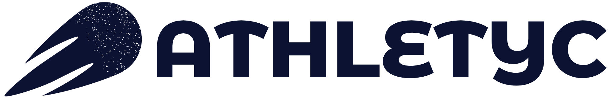
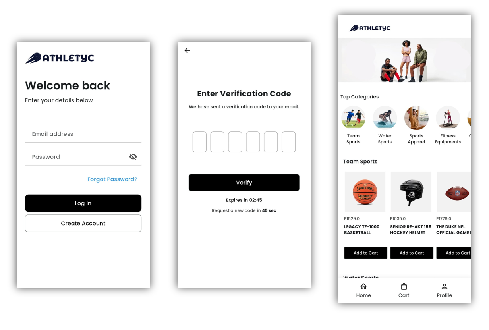
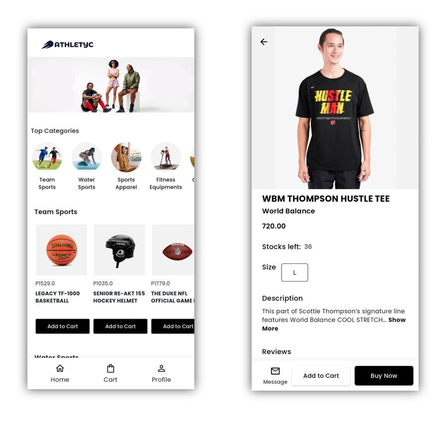
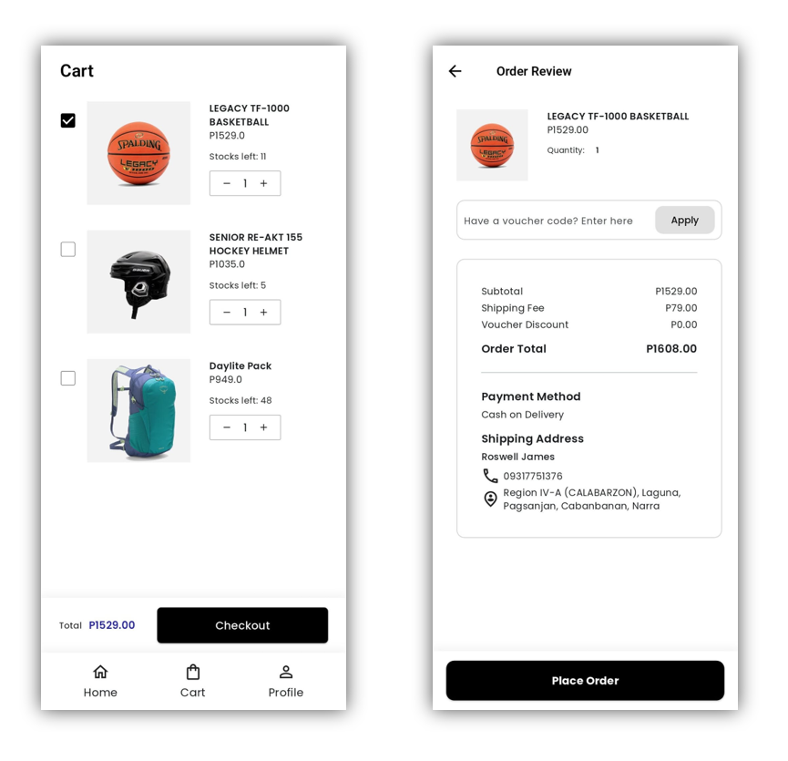
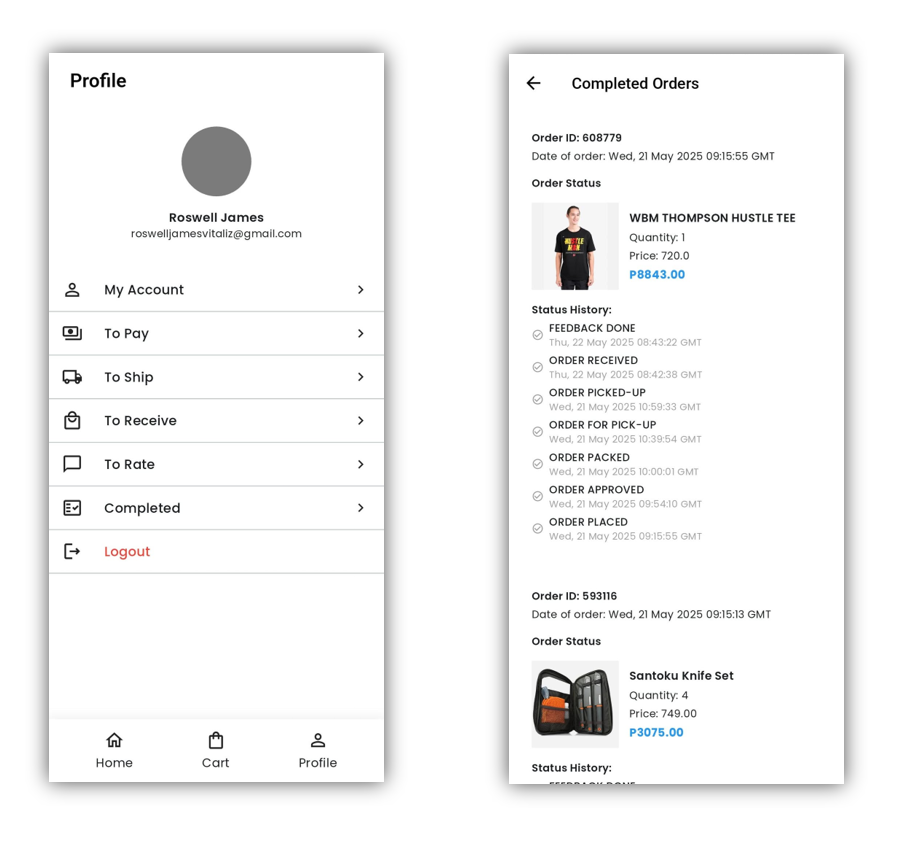

# Athletyc Mobile App

<p align="center">
  
</p>

A Flutter-based e-commerce application for sports and athletic equipment.

## Features

### Authentication
- User-friendly login and registration system
- Email verification for enhanced security
- Password recovery functionality
- Profile management

### Shopping Experience
- Browse products by categories:
  - Team Sports
  - Water Sports
  - Sports Apparel
  - Fitness Equipment
  - Biking
  - Camping & Hiking

### Product Features
- Detailed product views with:
  - High-quality images
  - Product descriptions
  - Price information
  - Stock availability
  - Size selection (for apparel)
  - Add to cart functionality

### Shopping Cart
- Easy-to-use cart management
- Quantity adjustment
- Product selection/deselection
- Total price calculation
- Voucher code support

### Checkout Process
- Order review
- Multiple payment methods including:
  - Cash on Delivery
- Shipping address management
- Order total calculation with:
  - Subtotal
  - Shipping fee
  - Voucher discounts

### Order Management
- Complete order history
- Detailed status tracking:
  - Order placed
  - Order approved
  - Order packed
  - Order for pick-up
  - Order picked-up
  - Order received
  - Feedback completion
- Order ID tracking

### User Profile
- Personal information management
- Order tracking sections:
  - To Pay
  - To Ship
  - To Receive
  - To Rate
  - Completed Orders
- Easy logout functionality

## Screenshots

### Authentication & Home


The authentication screens provide a secure and user-friendly entry point to the app:
- **Login Screen**:
  - Email and password authentication
  - Password visibility toggle
  - "Forgot Password?" link for password recovery
  - Option to create a new account
- **Email Verification**:
  - 6-digit verification code input
  - Timer for code expiration (2:45 minutes)
  - Option to request a new code after 45 seconds
  - Back navigation for correction
- **Home Screen**:
  - Clean, modern interface with the Athletyc logo
  - Top categories displayed as scrollable cards
  - Visual category icons for easy navigation
  - Featured products and promotions

### Shopping Experience


The shopping interface offers an intuitive browsing experience:
- **Category Navigation**:
  - Team Sports (Basketball, Hockey, Football)
  - Water Sports
  - Sports Apparel
  - Fitness Equipment
  - Biking
  - Camping & Hiking
- **Product Display**:
  - High-quality product images
  - Clear pricing in Philippine Peso (₱)
  - Product names and descriptions
  - Stock availability information
  - "Add to Cart" functionality
- **Product Details**:
  - Size selection for apparel
  - Detailed product descriptions
  - Stock count
  - Price information
  - Brand details

### Cart & Checkout


A streamlined shopping cart and checkout process:
- **Shopping Cart**:
  - Item selection checkboxes
  - Quantity adjustment controls (+ and -)
  - Individual item prices
  - Stock availability display
  - Running total calculation
- **Checkout Process**:
  - Order summary
  - Voucher code input field
  - Price breakdown:
    - Subtotal
    - Shipping fee (₱79.00)
    - Voucher discounts
    - Final total
  - Shipping address input
  - Payment method selection (Cash on Delivery)

### Profile & Orders


Comprehensive user profile and order management:
- **User Profile**:
  - Profile picture and personal information
  - Email address display
  - Account management options
- **Order Management Sections**:
  - To Pay: Pending payments
  - To Ship: Orders being processed
  - To Receive: Items in transit
  - To Rate: Delivered items awaiting feedback
  - Completed: Order history
- **Order Tracking**:
  - Detailed order status history
  - Timestamps for each status change
  - Order IDs for reference
  - Complete order details including:
    - Product information
    - Quantity
    - Price
    - Status updates

## Tech Stack

- Flutter SDK ^3.6.0
- GetX for state management
- Shared Preferences for local storage
- HTTP package for API integration
- Image Picker for image handling
- Custom UI components with Material Design
- Native splash screen and app icon integration
- Custom fonts (Poppins) and theming

## Getting Started

### Prerequisites

- Flutter SDK (^3.6.0)
- Dart SDK
- Android Studio / VS Code
- Git

### Installation

1. Clone the repository
```bash
git clone https://github.com/rswlljms/athletyc_mobile.git
```

2. Navigate to the project directory
```bash
cd athletyc_mobile
```

3. Install dependencies
```bash
flutter pub get
```

4. Run the app
```bash
flutter run
```

## Project Structure

```
lib/
├── screens/         # All app screens
│   ├── buyer/       # Buyer-specific screens
│   └── sign_in/     # Authentication screens
├── models/          # Data models
├── utils/          # Utility functions
└── main.dart       # App entry point
```

## Developers

This project was developed by:
- Articona, John Nico T.
- Noguera, Fhammiell D.
- Valdellon, Christine Nicole P.
- Vitaliz, Roswell James D.


## Contact

For any inquiries about this project, please contact any of the developers listed above.

Project Link: [https://github.com/rswlljms/athletyc_mobile](https://github.com/rswlljms/athletyc_mobile)
